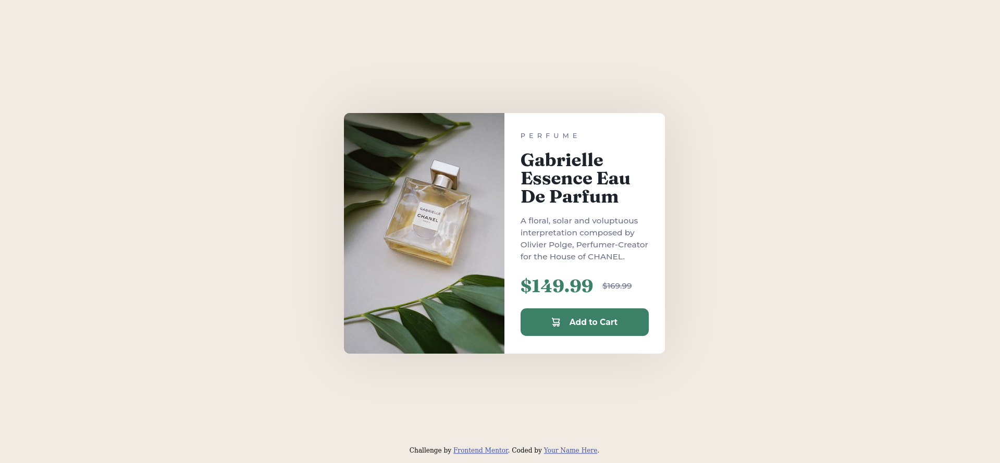

# Frontend Mentor - Product preview card component solution

This is a solution to the [Product preview card component challenge on Frontend Mentor](https://www.frontendmentor.io/challenges/product-preview-card-component-GO7UmttRfa). Frontend Mentor challenges help you improve your coding skills by building realistic projects.

## Table of contents

- [Overview](#overview)
  - [The challenge](#the-challenge)
  - [Screenshot](#screenshot)
  - [Links](#links)
- [My process](#my-process)
  - [Built with](#built-with)
  - [What I learned](#what-i-learned)
  - [Continued development](#continued-development)
- [Author](#author)

## Overview

### The challenge

Users should be able to:

- View the optimal layout depending on their device's screen size
- See hover and focus states for interactive elements

### Screenshot



### Links

- Solution URL: [https://github.com/DeivissonLisboa/frontend-mentor-product-preview-card-component](https://github.com/DeivissonLisboa/frontend-mentor-product-preview-card-component)
- Live Site URL: [https://deivissonlisboa.github.io/frontend-mentor-product-preview-card-component/](https://deivissonlisboa.github.io/frontend-mentor-product-preview-card-component/)

## My process

### Built with

- Semantic HTML5 markup
- CSS custom properties
- CSS Grid
- Mobile-first workflow

### What I learned

In this project, I attempted to estimate the time it would take to complete and ended up taking one and a half hours, which was 30 minutes more than I estimated.

```css
@media (min-width: 35rem) {
  main {
    max-width: 35rem;
    display: grid;
    grid-template-columns: repeat(2, 1fr);
  }
}
```

Working with the mobile-first workflow is enjoyable, as it is significantly easier compared to its counterpart.

### Continued development

semantic HTML, CUBE CSS still new to me and i'll be jure to learn more.

## Author

- Frontend Mentor - [@DeivissonLisboa](https://www.frontendmentor.io/profile/DeivissonLisboa)
